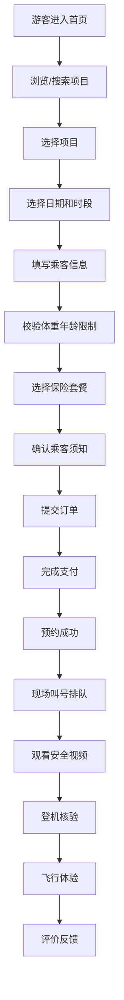

# 低空文旅飞行服务 Web 门户 - 产品需求文档 (PRD)

## 1. 产品概述

低空文旅飞行服务 Web 门户是一个面向景区运营方和游客的综合性飞行体验服务平台，支持直升机、热气球、观光无人机等低空飞行项目的在线发布、预约和运营管理。

- **核心目标**：解决低空文旅项目线上化运营痛点，提升游客预约体验和景区运营效率
- **目标用户**：景区运营方（项目管理、运营分析）、游客（在线预约、现场体验）
- **市场价值**：填补低空文旅数字化服务空白，推动文旅产业转型升级

## 2. 核心功能

### 2.1 用户角色

| 角色 | 注册方式 | 核心权限 |
|------|----------|----------|
| 游客 | 手机号注册 | 浏览项目、在线预约、订单管理、评价反馈 |
| 景区运营方 | 企业认证注册 | 项目上架、库存管理、订单处理、现场核验、经营数据分析 |
| 系统管理员 | 后台账号 | 用户管理、平台配置、投诉处理 |

### 2.2 功能模块

1. **项目首页**：项目展示、分类筛选、搜索、推荐项目、公告轮播
2. **预订页**：项目详情、时段库存、票价设置、乘客信息填写、保险选择、须知确认
3. **订单页**：订单列表、订单详情、改签退票、候补排队、支付记录
4. **现场核验**：叫号系统、登机核验、安全视频观看、体重年龄校验
5. **公告管理**：天气停飞公告、项目公告、紧急通知
6. **评价中心**：用户评价、评分统计、投诉处理、反馈回复
7. **经营报表**：客流热力图、收入统计、订单分析、项目运营数据

### 2.3 页面详情

| 页面名称 | 模块名称 | 功能描述 |
|----------|----------|----------|
| 项目首页 | 导航栏 | Logo、搜索框、用户中心、订单入口 |
| 项目首页 | Banner轮播 | 热门项目推荐、公告展示 |
| 项目首页 | 分类筛选 | 直升机/热气球/无人机分类、价格区间、时间段筛选 |
| 项目首页 | 项目列表 | 项目卡片（封面图、名称、价格、评分、销量） |
| 项目首页 | 推荐专区 | 精选项目、限时特惠、新品上架 |
| 预订页 | 项目详情 | 项目介绍、图片轮播、详细描述、安全须知 |
| 预订页 | 时段选择 | 日历选择、时段库存显示、票价展示 |
| 预订页 | 乘客信息 | 姓名、身份证号、手机号、体重、年龄填写 |
| 预订页 | 保险选择 | 保险套餐选择、保费计算 |
| 预订页 | 须知确认 | 乘客须知勾选、安全协议确认 |
| 订单页 | 订单列表 | 全部/待支付/待出行/已完成/已取消订单 |
| 订单页 | 订单详情 | 航班信息、乘客信息、支付信息、订单状态 |
| 订单页 | 改签退票 | 改签申请、退票申请、费用计算 |
| 订单页 | 候补排队 | 候补申请、排队位置、候补成功通知 |
| 现场核验 | 叫号系统 | 当前叫号、等待人数、预计等待时间 |
| 现场核验 | 登机核验 | 二维码扫描、身份证核验、体重年龄校验 |
| 现场核验 | 安全视频 | 视频播放、观看进度、观看确认 |
| 公告管理 | 公告列表 | 公告发布、编辑、删除、置顶 |
| 公告管理 | 天气公告 | 天气停飞自动预警、手动发布 |
| 评价中心 | 评价列表 | 用户评价、评分、图片上传 |
| 评价中心 | 投诉处理 | 投诉接收、处理进度、结果反馈 |
| 经营报表 | 客流热力 | 时段客流热力图、项目客流分布 |
| 经营报表 | 收入统计 | 日/月/年收入趋势、项目收入占比 |
| 经营报表 | 订单分析 | 订单量、转化率、退票率统计 |

## 3. 核心流程

### 3.1 游客预约流程

游客浏览项目 → 选择项目和时段 → 填写乘客信息 → 选择保险 → 确认乘客须知 → 提交订单 → 完成支付 → 预约成功 → 现场叫号 → 安全视频观看 → 登机核验 → 飞行体验 → 评价反馈

### 3.2 运营方管理流程

运营方登录 → 项目上架（信息、图片、票价设置）→ 时段库存配置 → 查看订单 → 订单处理 → 现场叫号管理 → 登机核验 → 查看经营报表 → 回复评价/处理投诉

### 3.3 核心流程图

## 4. 用户界面设计

### 4.1 设计风格

- **主色调**：天空蓝 (#1E88E5) - 代表飞行、信任、专业
- **辅助色**：阳光橙 (#FF9800) - 代表活力、热情、行动
- **中性色**：深灰 (#333333)、中灰 (#666666)、浅灰 (#F5F7FA)、白色 (#FFFFFF)
- **按钮风格**：圆角矩形 (8px)、渐变填充、悬停微放大动画
- **字体**：
  - 标题：Noto Sans SC Bold（现代无衬线，清晰有力）
  - 正文：Noto Sans SC Regular（舒适可读）
- **布局风格**：卡片式布局、白色卡片配浅灰底色、清晰的视觉层次
- **图标风格**：线性图标 (lucide-react)、统一 24px 尺寸、主色调填充

### 4.2 页面设计概述

| 页面名称 | 模块名称 | UI元素 |
|----------|----------|--------|
| 项目首页 | Banner | 全屏宽轮播图、渐变遮罩、动态切换动画 |
| 项目首页 | 项目卡片 | 圆角图片、悬浮阴影、价格标签突出显示 |
| 项目首页 | 筛选区 | 标签式筛选、下拉选择器、滑动价格条 |
| 预订页 | 项目详情 | 图片轮播画廊、标签式详情切换、固定底部预订栏 |
| 预订页 | 时段选择 | 日历组件、时段网格、库存状态颜色标识 |
| 订单页 | 订单卡片 | 状态标签、时间轴进度、操作按钮组 |
| 现场核验 | 叫号屏 | 大字号数字显示、滚动动画、状态指示灯 |
| 经营报表 | 数据图表 | 热力图、折线图、饼图、数据卡片 |

### 4.3 响应式设计

- **设计原则**：Desktop-first，向下适配移动端
- **断点设置**：
  - 桌面端：≥ 1200px（多列布局）
  - 平板端：768px - 1199px（两列布局）
  - 移动端：< 768px（单列布局，底部导航）
- **触控优化**：按钮最小尺寸 44px × 44px，足够点击间距

### 4.4 动效设计

- **页面过渡**：淡入淡出 + 轻微位移 (300ms ease-out)
- **卡片悬浮**：上移 4px + 阴影加深 (200ms)
- **按钮交互**：点击时缩放 0.97 (150ms)
- **加载状态**：骨架屏 + 脉冲动画
- **叫号动画**：数字滚动 + 高亮闪烁
