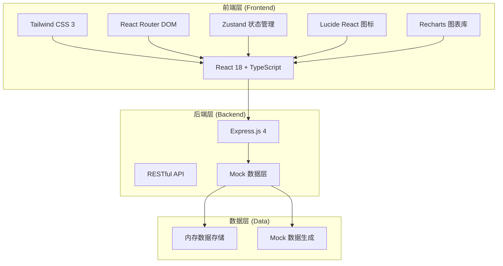
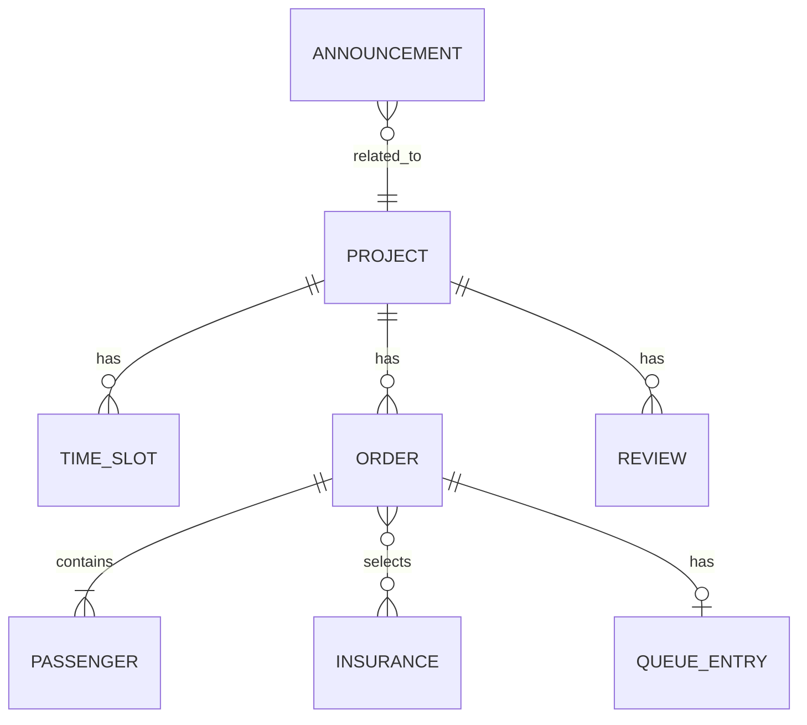

# 低空文旅飞行服务 Web 门户 - 技术架构文档

## 1. 架构设计



## 2. 技术描述

### 2.1 技术选型

| 层级 | 技术栈 | 版本 | 说明 |
|------|--------|------|------|
| 前端框架 | React | 18.x | 组件化 UI 框架 |
| 前端语言 | TypeScript | 5.x | 类型安全的 JavaScript |
| 构建工具 | Vite | 5.x | 快速的前端构建工具 |
| CSS 框架 | Tailwind CSS | 3.x | 实用优先的 CSS 框架 |
| 路由管理 | React Router DOM | 6.x | 单页应用路由 |
| 状态管理 | Zustand | 4.x | 轻量级状态管理 |
| 图标库 | Lucide React | 0.x | 现代化图标库 |
| 图表库 | Recharts | 2.x | React 图表组件库 |
| 后端框架 | Express.js | 4.x | Node.js Web 框架 |
| HTTP 客户端 | Fetch API | - | 浏览器原生 API |

### 2.2 项目初始化

- 使用 `react-express-ts` 模板初始化项目
- 前后端分离架构，Express 提供 API 服务
- 前端通过 Fetch API 与后端通信
- 使用 Mock 数据模拟真实业务场景

## 3. 路由定义

### 3.1 前端路由

| 路由路径 | 页面名称 | 说明 |
|----------|----------|------|
| `/` | 项目首页 | 项目列表、搜索筛选、推荐展示 |
| `/project/:id` | 预订页 | 项目详情、时段选择、在线预订 |
| `/orders` | 订单列表 | 我的订单、状态筛选 |
| `/orders/:id` | 订单详情 | 订单详情、改签退票操作 |
| `/checkin` | 现场核验 | 叫号系统、登机核验 |
| `/safety-video` | 安全视频 | 安全视频观看页面 |
| `/admin/announcements` | 公告管理 | 公告发布、编辑、管理 |
| `/admin/reviews` | 评价中心 | 评价查看、投诉处理 |
| `/admin/reports` | 经营报表 | 客流热力、收入统计、数据分析 |

### 3.2 API 路由

| 方法 | 路径 | 说明 |
|------|------|------|
| GET | `/api/projects` | 获取项目列表 |
| GET | `/api/projects/:id` | 获取项目详情 |
| GET | `/api/projects/:id/slots` | 获取项目时段库存 |
| POST | `/api/orders` | 创建订单 |
| GET | `/api/orders` | 获取订单列表 |
| GET | `/api/orders/:id` | 获取订单详情 |
| PUT | `/api/orders/:id/cancel` | 取消订单 |
| PUT | `/api/orders/:id/reschedule` | 改签订单 |
| POST | `/api/orders/:id/waitlist` | 加入候补 |
| GET | `/api/queue/current` | 获取当前叫号 |
| POST | `/api/queue/next` | 叫下一号 |
| POST | `/api/checkin/verify` | 登机核验 |
| GET | `/api/announcements` | 获取公告列表 |
| POST | `/api/announcements` | 发布公告 |
| GET | `/api/reviews` | 获取评价列表 |
| POST | `/api/reviews` | 提交评价 |
| GET | `/api/reports/overview` | 获取经营概览 |
| GET | `/api/reports/heatmap` | 获取客流热力数据 |
| GET | `/api/reports/revenue` | 获取收入统计 |

## 4. API 数据类型定义

```typescript
// 项目类型
interface Project {
  id: string;
  name: string;
  type: 'helicopter' | 'balloon' | 'drone';
  description: string;
  images: string[];
  basePrice: number;
  duration: number; // 分钟
  rating: number;
  salesCount: number;
  minAge: number;
  maxAge: number;
  minWeight: number;
  maxWeight: number;
  safetyNotes: string[];
  features: string[];
}

// 时段库存
interface TimeSlot {
  id: string;
  date: string;
  startTime: string;
  endTime: string;
  price: number;
  totalStock: number;
  availableStock: number;
  status: 'available' | 'limited' | 'soldout';
}

// 乘客信息
interface Passenger {
  name: string;
  idCard: string;
  phone: string;
  age: number;
  weight: number;
}

// 保险套餐
interface Insurance {
  id: string;
  name: string;
  price: number;
  coverage: string;
}

// 订单
interface Order {
  id: string;
  orderNo: string;
  projectId: string;
  projectName: string;
  slotId: string;
  slotDate: string;
  slotTime: string;
  passengers: Passenger[];
  insuranceIds: string[];
  totalAmount: number;
  status: 'pending' | 'paid' | 'waiting' | 'boarding' | 'completed' | 'cancelled' | 'refunded';
  createTime: string;
  payTime?: string;
  queueNumber?: number;
}

// 叫号信息
interface QueueInfo {
  currentNumber: number;
  waitingCount: number;
  estimatedWaitTime: number; // 分钟
}

// 公告
interface Announcement {
  id: string;
  title: string;
  content: string;
  type: 'weather' | 'notice' | 'emergency';
  isTop: boolean;
  createTime: string;
}

// 评价
interface Review {
  id: string;
  orderId: string;
  projectId: string;
  rating: number;
  content: string;
  images: string[];
  createTime: string;
  reply?: string;
}

// 经营数据
interface ReportData {
  totalOrders: number;
  totalRevenue: number;
  totalPassengers: number;
  avgRating: number;
}
```

## 5. 数据模型

### 5.1 实体关系图



### 5.2 数据模型说明

| 实体 | 关键字段 | 说明 |
|------|----------|------|
| Project | id, name, type, basePrice, minAge, maxWeight | 飞行项目主表 |
| TimeSlot | id, projectId, date, startTime, availableStock | 时段库存表 |
| Order | id, orderNo, projectId, slotId, status, totalAmount | 订单主表 |
| Passenger | id, orderId, name, idCard, age, weight | 乘客信息表 |
| Insurance | id, name, price, coverage | 保险产品表 |
| QueueEntry | id, orderId, queueNumber, status | 叫号队列表 |
| Announcement | id, title, type, content, isTop | 公告表 |
| Review | id, orderId, rating, content, reply | 评价表 |

## 6. 项目目录结构

```
.
├── src/                     # 前端源代码
│   ├── components/          # 公共组件
│   │   ├── layout/         # 布局组件
│   │   ├── ui/             # 基础 UI 组件
│   │   └── business/       # 业务组件
│   ├── pages/              # 页面组件
│   │   ├── Home/           # 首页
│   │   ├── ProjectDetail/  # 预订页
│   │   ├── Orders/         # 订单页
│   │   ├── Checkin/        # 现场核验
│   │   └── Admin/          # 管理后台
│   ├── hooks/              # 自定义 Hooks
│   ├── store/              # Zustand 状态管理
│   ├── types/              # TypeScript 类型定义
│   ├── utils/              # 工具函数
│   ├── services/           # API 服务
│   ├── mock/               # Mock 数据
│   └── App.tsx             # 应用入口
├── api/                    # 后端源代码
│   ├── routes/             # 路由定义
│   ├── controllers/        # 控制器
│   ├── services/           # 业务逻辑
│   ├── data/               # 数据存储
│   └── index.ts            # 服务入口
└── shared/                 # 共享类型定义
    └── types.ts
```
